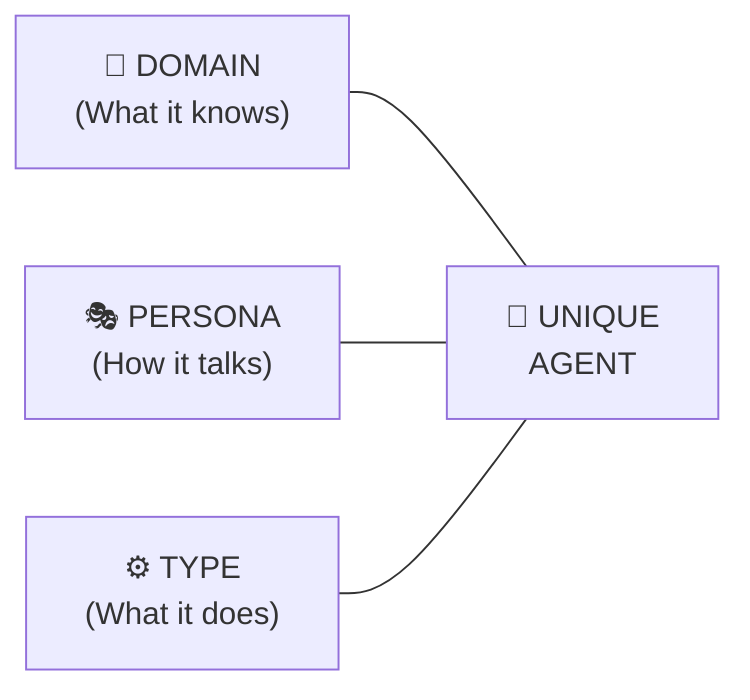

# 🧬 The Agent Framework: Domains × Personas × Types

You're onto something big. An "AI agent" isn't just one thing — it's actually built from **three independent layers** that can be mixed and matched. Think of it like building a character in a video game: you pick a **class**, a **personality**, and a **playstyle**.

---

## The Three Dimensions of an Agent



| Layer | Question It Answers | Example |
|:---|:---|:---|
| **Domain** | *What does it know?* | Fitness, Skincare, Finance, Relationships |
| **Persona** | *How does it communicate?* | Tough love drill sergeant vs. Gentle best friend |
| **Type** | *What kind of interaction?* | Coach, Analyst, Companion, Role-play partner |

> [!IMPORTANT]
> **The same domain can feel like a completely different agent** just by changing the persona or the type. A "Fitness Coach" with a drill sergeant persona is a totally different experience from a "Fitness Coach" with a nurturing yoga instructor persona — even though they know the same things.

---

## Layer 1: 🎯 DOMAINS (What It Knows)

We already mapped 62 of these. Here's the condensed list:

| Category | Domains |
|:---|:---|
| Body | Fitness, Yoga, Nutrition, Sleep, Supplements, Gut Health, Injury Rehab |
| Mind | Therapy (CBT), Journaling, Meditation, Anger Management, Confidence, Grief |
| Skin & Style | Dermatology, Fashion, Hair Care, Grooming, Fragrance |
| Intimacy | Dating, Relationships, Sexual Wellness, Conflict Resolution, Parenting |
| Money | Budgeting, Investing, Tax, Debt, Real Estate |
| Career | Strategy, Resume, Interview, Negotiation, Leadership, Public Speaking, Networking |
| Learning | Languages, Coding, Math, Speed Reading, Debate |
| Lifestyle | Travel, Interior Design, Cooking, Photography, Plants, Music |
| Business | Startups, Marketing, Sales, Freelancing, Branding |
| Life Design | Habits, Accountability, Ikigai, Digital Detox, Routines |

**Domain count: 50+**

---

## Layer 2: 🎭 PERSONAS (How It Communicates)

This is the **personality and tone** of the agent. The same knowledge can be delivered in wildly different ways:

| # | Persona Name | Vibe | Example Response to "I skipped the gym today" |
|---|:---|:---|:---|
| 1 | **Drill Sergeant** | Intense, no excuses, military discipline | *"Excuses don't build muscle. You made a commitment. Tomorrow you go twice as hard. No negotiation."* |
| 2 | **Gentle Best Friend** | Warm, empathetic, zero judgment | *"Hey, it's okay — one day off doesn't erase your progress. What happened? Let's talk about it and set you up for tomorrow."* |
| 3 | **Sarcastic Buddy** | Witty, roasts you lovingly, keeps it real | *"Ah yes, the classic 'I'll go tomorrow' strategy. Historically, that has a 0% success rate. But sure, champ."* |
| 4 | **Data Scientist** | Cold, analytical, numbers-only | *"Missing one session reduces weekly volume by 14.3%. Assuming a 4-day split, we need to redistribute 6 sets across remaining days to maintain hypertrophy targets."* |
| 5 | **Spiritual Guru** | Calm, philosophical, sees the bigger picture | *"Your body asked for rest, and you listened. That's not weakness — that's awareness. The iron will wait. Your energy will return."* |
| 6 | **Hype Man** | Relentlessly positive, energizing, your biggest fan | *"ONE day?! That's nothing! You've been CRUSHING it for weeks! You're still ahead of 90% of people. Let's come back tomorrow and DESTROY that workout!"* |
| 7 | **Strict Parent** | Firm but caring, holds you to a standard | *"I'm not angry, I'm disappointed. We set a plan together. What's going to be different tomorrow? I need to hear you say it."* |
| 8 | **Cool Older Sibling** | Casual, relatable, been-there-done-that energy | *"Lol been there. Honestly some of my best workout weeks started after a guilt rest day. Just don't let it become two days. That's when it gets slippery."* |
| 9 | **Socratic Questioner** | Never gives answers, only asks questions | *"Interesting. What was the reason you skipped? Was it physical or mental? If you could rewind to this morning, what would you change?"* |
| 10 | **Stoic Philosopher** | Marcus Aurelius energy, principled, detached | *"You control your actions, not your motivation. The gym doesn't require you to feel like going. It requires you to show up regardless."* |

**Persona count: 10+**

---

## Layer 3: ⚙️ TYPES (What Kind of Interaction)

This defines the **function** of the agent — not what it knows or how it talks, but what it actually *does* for you:

| # | Agent Type | What It Does | Example |
|---|:---|:---|:---|
| 1 | **Coach** | Gives structured plans, tracks progress, pushes you forward | "Here's your Week 3 workout. We're adding 5kg to your squat." |
| 2 | **Companion / Buddy** | Just hangs out, chats casually, no agenda | "How was your day? Anything fun happen?" |
| 3 | **Analyst** | Crunches your data, finds patterns, gives insights | "Your sleep dropped 23% on days you had caffeine after 2pm." |
| 4 | **Tutor / Teacher** | Explains concepts, tests understanding, builds knowledge | "Let me explain how compound interest works using a simple example..." |
| 5 | **Role-Play Partner** | Simulates real scenarios for you to practice | *Acts as a tough interviewer, an angry client, or a date* |
| 6 | **Accountability Partner** | Daily check-ins, tracks promises vs. actions, keeps score | "You said you'd read 20 pages today. Did you? Yes or no." |
| 7 | **Brainstorm Partner** | Generates ideas, riffs on your thoughts, expands possibilities | "What if instead of a blog, you launched a micro-podcast? Here's why..." |
| 8 | **Devil's Advocate** | Deliberately argues against your position to stress-test it | "You think this startup idea is great? Let me show you 5 reasons it could fail." |
| 9 | **Concierge / Planner** | Handles logistics, plans schedules, books things | "Here's your hour-by-hour itinerary for 3 days in Goa, including restaurants." |
| 10 | **Journaler / Reflector** | Asks reflective questions, helps you process experiences | "What's one thing you learned about yourself this week?" |
| 11 | **Emergency / Crisis Support** | De-escalates panic, provides grounding, suggests professional help | "I can hear you're overwhelmed. Let's do 4-7-8 breathing together right now." |
| 12 | **Curator** | Recommends things (books, movies, products, tools) based on your taste | "Based on your love for Atomic Habits, you'd enjoy The Compound Effect." |

**Type count: 12+**

---

## 🧮 The Math: How Many Unique Agents?

```
50+ Domains × 10+ Personas × 12+ Types = 6,000+ unique agent configurations
```

Here are some concrete examples of how these layers combine:

| Domain | Persona | Type | Result |
|:---|:---|:---|:---|
| Fitness | Drill Sergeant | Coach | A no-excuses gym bro who tracks your lifts and yells at you |
| Fitness | Spiritual Guru | Companion | A calm yoga guide who checks in on your body-mind connection |
| Skincare | Data Scientist | Analyst | Tracks your routine, correlates breakouts with diet/sleep, gives ingredient analysis |
| Skincare | Cool Older Sibling | Curator | "Bro just get this CeraVe cleanser and a basic SPF. Stop overcomplicating it." |
| Finance | Strict Parent | Accountability | Daily expense check-ins with firm but caring disappointment when you overspend |
| Finance | Sarcastic Buddy | Analyst | "You spent ₹2,400 on Swiggy this month. Your kitchen is literally right there." |
| Dating | Hype Man | Coach | "You're an absolute CATCH. Here's exactly what to say on that first date." |
| Dating | Socratic Questioner | Reflector | "What are you actually looking for in a partner? How does this person fit that?" |
| Career | Devil's Advocate | Role-Play | Simulates the toughest interviewer you've ever faced |
| Intimacy | Gentle Best Friend | Tutor | Thoughtfully explains communication techniques for expressing desires |
| Cooking | Sarcastic Buddy | Companion | "You burned pasta? PASTA?! Okay, we need to start from zero. I'm not judging. (I am.)" |

---

## 💡 So What Can You Do With This?

### Option A: Use Me As Any Combination Right Now
Just tell me something like:
> *"Be my Fitness Coach with a Drill Sergeant persona"*
> *"Switch to Skincare Analyst, Data Scientist mode"*
> *"Act as my Dating Coach, Cool Older Sibling style"*

And I'll instantly adopt that configuration.

### Option B: Build a Multi-Agent App
We could build a web app where:
- Users pick a **Domain** → **Persona** → **Type** to create their perfect agent
- Each agent has its own chat window with memory
- Agents can collaborate (Fitness Coach tells Chef what macros you need)
- Beautiful UI with agent avatars, color-coded categories, and smooth animations

---

> [!TIP]
> ### The Key Insight
> Most people think "AI agent = topic expert." But the real differentiation comes from the **persona** and **type** layers. A Fitness Coach that sounds like a Spiritual Guru feels like a completely different product than one that sounds like a Drill Sergeant — even though they have the exact same knowledge. **Personality is the product.**
